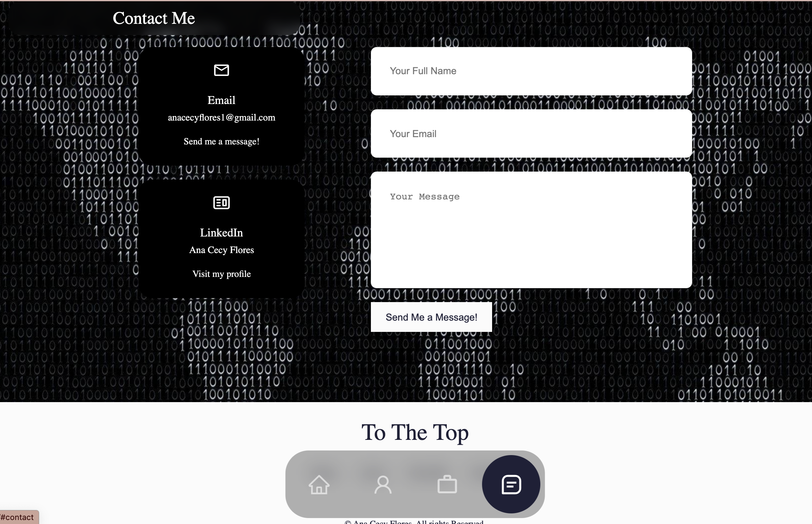
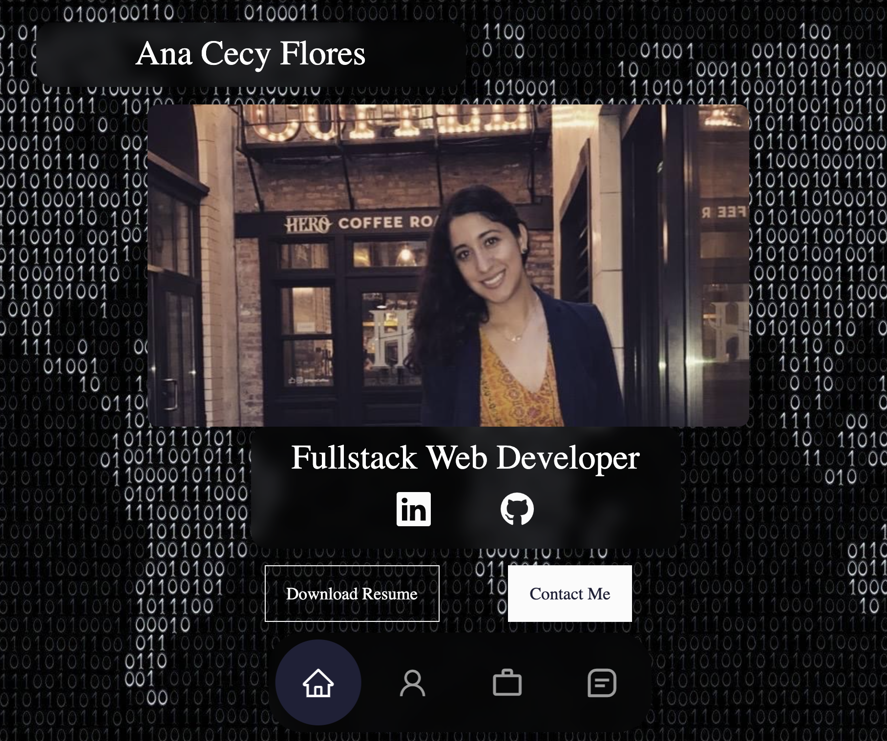

# ReactPortfolio

[Deployed App Link](https://acf-react-portfolio.herokuapp.com/#)


## Table of Contents

- [Description](#description)
- [Usage](#usage)
- [Screenshots](#screenshots)
- [Questions](#questions)
- [License](#license)

## Description

Professional Portfolio using REACT.

## Usage

Install dependencies:

```
npm i
```

Start the application/download repo:

```
npm run dev
```

**[⬆ back to top](#table-of-contents)**

## Screenshots

```
About:
```

<br>
 
<br>

```
Contact:
```

<br>
 
<br>

```
Home Page:
```

<br>
 
<br>

```
Portfolio:
```

<br>
 
<br>

**[⬆ back to top](#table-of-contents)**

## Questions

Contact me here:

<a href="mailto: anacecyflores1@gmail.com"></a><a href="https://www.linkedin.com/in/anacecyflores/"></a><a href="https://cecy-professional-portfolio.herokuapp.com/" target="_blank"></a>

**[⬆ back to top](#table-of-contents)**

## License

Copyright (c) 2022 Ana Cecilia Flores

Licensed under the [MIT](LICENSE) license.

**[⬆ back to top](#table-of-contents)**
